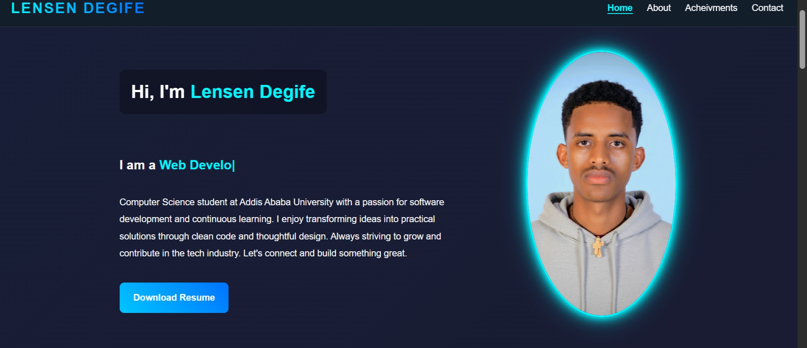
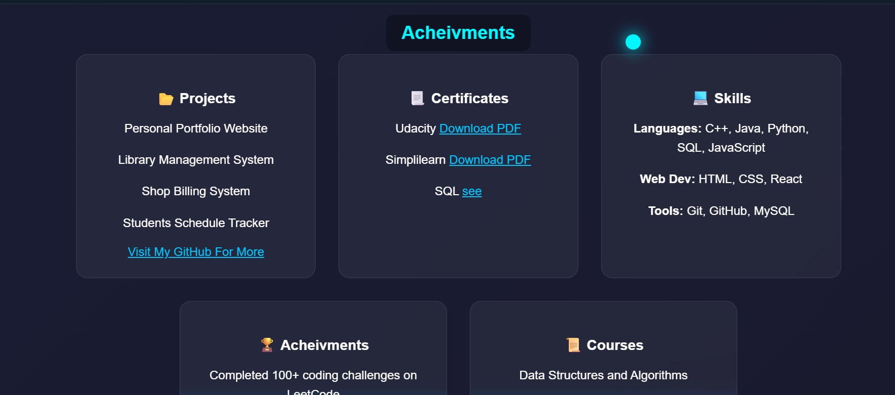

# Lensen Degife Portfolio

Welcome to my personal portfolio website!
This project showcases my skills, projects, and experience as a Computer Science student and aspiring software developer.

🚀**Live Demo:**
👉 https://lensen-degife.github.io/my-portifolio1/


##  About Me

I am a Computer Science student with a strong passion for building modern, responsive, and user-friendly applications.
I have experience working with both frontend and backend technologies and enjoy solving real-world problems through code.


##  Tech Stack

* **Languages:** Java, C++, JavaScript, Python
* **Frontend:** HTML5, CSS3
* **Database:** MySQL, SQLite3
* **Tools:** Git, GitHub, IntelliJ IDEA

---

##  Features

*  Responsive design (mobile & desktop)
*  Clean and modern UI
*  Projects showcase section
*  About & contact sections
*  Smooth user experience

---

##  Projects

Some of the projects featured in this portfolio:

*  **Shop Billing System** (C++)
*  **Cafe Management System** (Java)
*  **Personal Portfolio Website**

 More projects on GitHub:
https://github.com/lensen-degife

---

##  Preview

<p align="center">
  
</p>
<p align="center">
  
</p


## Installation & Usage

To run this project locally:

```bash
git clone https://github.com/lensen-degife/my-portifolio1.git
cd my-portifolio1
```

Then open `index.html` in your browser.

## Contact

* Email: [lensendegife@gmail.com](mailto:lensendegife@gmail.com)
* Phone: +251 982 067 754
*  GitHub: https://github.com/lensen-degife


##  License

This project is open-source and available under the MIT License.


##  Author

**Lensen Degife**
Computer Science Student | Web Developer
