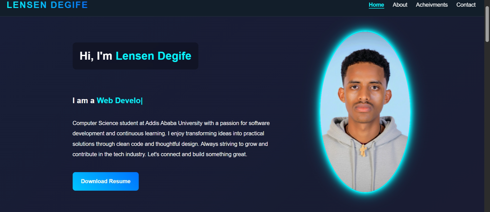
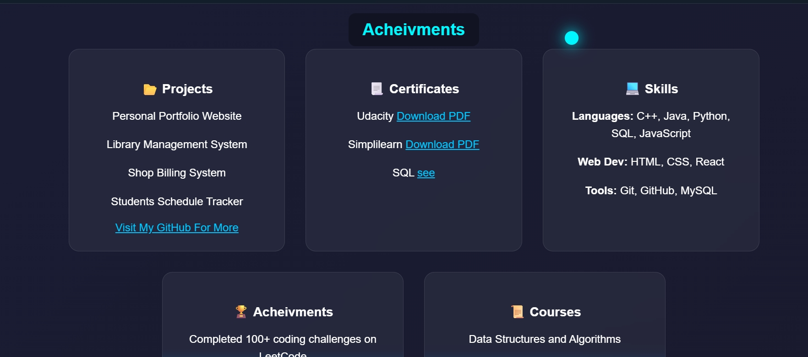

# Lensen Degife — Personal Portfolio

Modern personal portfolio website built with **React + Vite**.

**Live Demo:** [https://lensen-degife.github.io/my-portifolio1/](https://lensen-degife.github.io/my-portifolio1/)

---

## About

I am a Computer Science student at **Addis Ababa University** with a strong passion for building modern, responsive, and user-friendly applications. I enjoy transforming ideas into practical solutions through clean code and thoughtful design.

---

## Features

- Fully responsive design (mobile & desktop)
- Clean, modern UI with smooth interactions
- Custom cursor, progress bar, page preloader & overlay effects
- Typed.js animated text
- Sections: Home, About, Achievements (Projects / Certificates / Skills / Courses), Contact
- Downloadable resume & certificates

---

## Tech Stack

**Frontend**
- React 19
- Vite 8
- React Router
- Typed.js
- HTML5 / CSS3

**Languages & Tools I work with**
- Languages: C++, Java, Python, JavaScript, SQL
- Web: HTML, CSS, React
- Databases: MySQL, Microsoft SQL Server
- Tools: Git, GitHub

---

## Projects Featured

- Full Stack E-commerce web app
- Personal Portfolio Website (this project)
- Library Management System
- Shop Billing System (C++)
- Students Schedule Tracker
- Cafe Management System (Java)

More projects: [github.com/lensen-degife](https://github.com/lensen-degife)

---

## Getting Started

### Prerequisites
- Node.js (v18 or higher recommended)
- npm or yarn

### Installation

```bash
# Clone the repository
git clone https://github.com/lensen-degife/my-portifolio1.git
cd my-portifolio1/MyPortfolio/portfolio-project

# Install dependencies
npm install

# Start development server
npm run dev
```

Open [http://localhost:5173](http://localhost:5173) in your browser.

### Build for production

```bash
npm run build
npm run preview   # optional: preview the production build
```

---

## Project Structure

```
MyPortfolio/portfolio-project/
├── public/
├── src/
│   ├── assets/
│   ├── components/     # Nav, Footer, Cursor, ProgressBar, etc.
│   ├── pages/
│   │   ├── home/
│   │   ├── about/
│   │   ├── acheivment/
│   │   └── contact/
│   ├── App.jsx
│   ├── main.jsx
│   └── ...
├── index.html
├── package.json
└── vite.config.js
```

---

## Contact

- **Email:** [lensendegife@gmail.com](mailto:lensendegife@gmail.com)
- **Phone:** +251 982 067 754
- **GitHub:** [github.com/lensen-degife](https://github.com/lensen-degife)
- **LinkedIn:** [lensen-degife](https://www.linkedin.com/in/lensen-degife-60661b3b2)

---

##  Preview

<p align="center">
  
</p>
<p align="center">
  
</p


## Author

**Lensen Degife**  
Computer Science Student | Full-Stack Developer  
Addis Ababa University

---

## License

This project is open-source and available under the [MIT License](LICENSE).
```

### Key changes from the old README
- Reflects the **React + Vite** migration (no more “just open `index.html`”).
- Updated tech stack and features (custom cursor, preloader, Typed.js, etc.).
- Correct installation path (`MyPortfolio/portfolio-project`).
- Updated projects list from the live site.
- Added proper build/dev commands and project structure.
- Cleaner contact + author section.

Would you like me to also:
1. Make a shorter / more minimal version?
2. Add badges (stars, forks, tech stack shields)?
3. Include deployment instructions (GitHub Pages)?
4. Fix any specific details (typos like “Acheivments”, phone number, etc.)?

Just tell me what you want adjusted and I’ll refine it.
